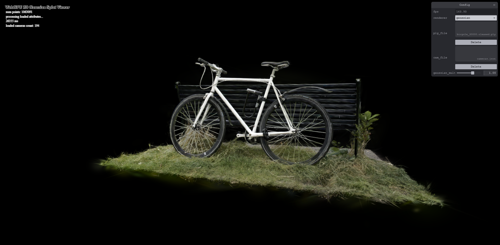
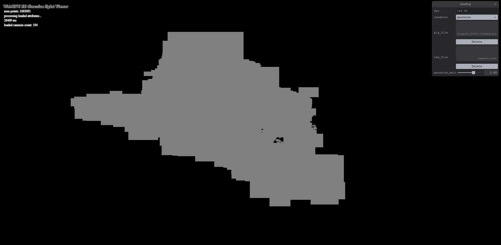
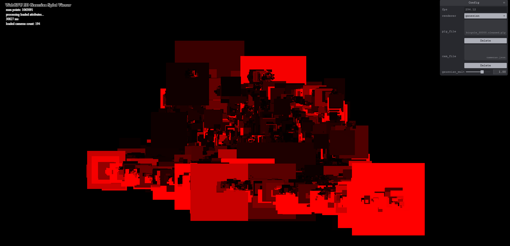
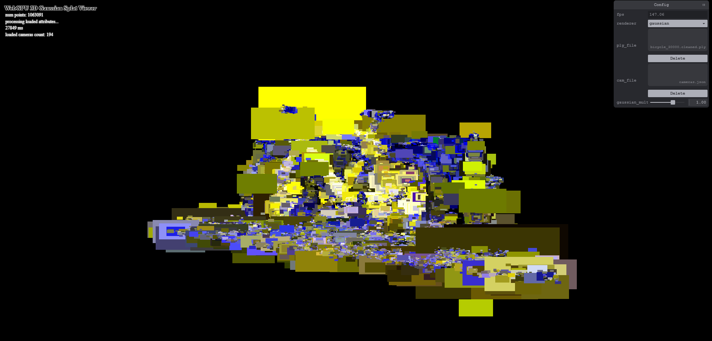
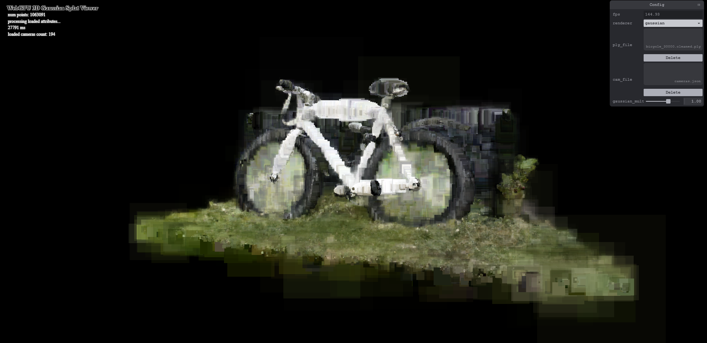
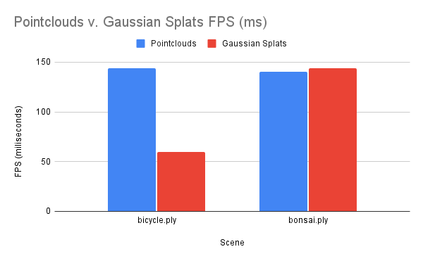

# Project5-WebGPU-Gaussian-Splat-Viewer

**University of Pennsylvania, CIS 565: GPU Programming and Architecture, Project 5**

* Jacqueline (Jackie) Li
  * [LinkedIn](https://www.linkedin.com/in/jackie-lii/), [personal website](https://sites.google.com/seas.upenn.edu/jacquelineli/home), [Instagram](https://www.instagram.com/sagescherrytree/), etc.
* Tested on: : Chrome/141.0.7390.67, : Windows NT 10.0.19045.6332, 11th Gen Intel(R) Core(TM) i7-11800H @ 2.30GHz, NVIDIA GeForce RTX 3060 Laptop GPU (6 GB)

### Live Demo

[Demo Link](https://sagescherrytree.github.io/Project5-WebGPU-Gaussian-Splat-Viewer-2025/)

### Demo Video/GIF

|  |  |
|:--:|:--:|
| Bicycle | Bonsai |

## Gaussian Splats Overview

Gaussian Splats is a concept first introduced in the paper [3D Gaussian Splatting for Real Time Rendering](https://repo-sam.inria.fr/fungraph/3d-gaussian-splatting/) by Kerbl et al at SIGGRAPH 2023. It is a concept which significantly optimised the neural radiance fields methodology, by representing the scene in 3D Gaussians that each carry properties of position, colour, size, and depth to recreate the scene while reducing unnecessary computations and thus optimising the runtime.

The portion that I focused on mainly for this project is not the actual training of the neural rendering representation, but the algorithm to render the resulting point clouds as Gaussian splats. For that, I set up a rendering pipeline on WebGPU that first passes the 3D Gaussian information to a preprocess compute shader to calculate each splat in an initial indirect render pass, then the created splat data will be passed to a vertex and fragment shader to be visualised. 

### Preprocess Step

To render the Gaussian splats, I first pass the point cloud points to a preprocess shader in an indirect render pass. The points are transformed to NDC, then I use the rotation and scale information from the gaussian data to calculate the 2D covariance (following [this reference](https://github.com/kwea123/gaussian_splatting_notes)). Colour is calculated using [spherical harmonics](https://beatthezombie.github.io/sh_post_1/). Depth information is calculated prior to the preprocess compute step by running radix sort on the splat indices, but is passed to the compute shader to update to the vertex and fragment visualisation shader. Finally, all of this information is stored in the splats buffer, which then gets passed in the actual render pass to vertex and fragment wgsl shader, that uses the information to visualise the splats.

Below is a breakdown of the different steps of the preprocess step, rendered as simple quads on the visualisation shader. These test scenes utilitse the bicycle.ply scene.

|  |
|:--:|
| Quads over points, plain visualisation (no colour, no depth) |

|  |
|:--:|
| Quads over depth visualisation |

|  |
|:--:|
| SH Coefficient visualisation |

### Visualisation Step

After the information from the preprocess step is calculated and repassed into the splats buffer, it gets passed through the render pass to a vertex shader, where all of the splat information is unpacked and used to draw the quads and its position in the vertex shader. The colour, size, and opacity get passed to the fragment shader, where the position gets converted to NDC again, and an alpha value is calculated to draw each quad with its correct transparency.

|  |
|:--:|
| Render output with no alpha |

|  |
|:--:|
| Render output with alpha included |

## Performance Anaylsis

### Number of Points v. Runtime Pointclouds and Runtime Gaussian

|    Scene    |  # of Points   | Pointclouds | Gaussian Splat |
|-------------|----------------|-------------|----------------|
| bicycle.ply |     1063091    |     144     |       60       |
| bonsai.ply  |     272956     |     140     |       144      |

|  |
|:--:|

### Gaussian Multiplier v. Runtime per Scene

| Multiplier | bicycle.ply | bonsai.ply |
|------------|-------------|------------|
|    0.0     |     54      |    144     |
|    1.0     |     60      |    144     |
|    1.5     |     17      |    84      |

|  |
|:--:|

### Workgroup size and Performance

### View Frustrum Culling and Performance

### Number of Gaussians and Performance

## Bloopers

### Credits

- [Vite](https://vitejs.dev/)
- [tweakpane](https://tweakpane.github.io/docs//v3/monitor-bindings/)
- [stats.js](https://github.com/mrdoob/stats.js)
- [wgpu-matrix](https://github.com/greggman/wgpu-matrix)
- Special Thanks to: Shrek Shao (Google WebGPU team) & [Differential Guassian Renderer](https://github.com/graphdeco-inria/diff-gaussian-rasterization)
