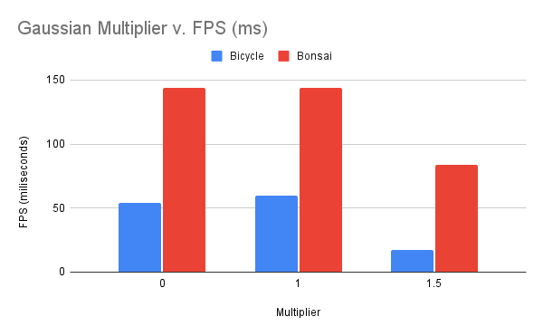

# Project5-WebGPU-Gaussian-Splat-Viewer

**University of Pennsylvania, CIS 565: GPU Programming and Architecture, Project 5**

* Jacqueline (Jackie) Li
  * [LinkedIn](https://www.linkedin.com/in/jackie-lii/), [personal website](https://sites.google.com/seas.upenn.edu/jacquelineli/home), [Instagram](https://www.instagram.com/sagescherrytree/), etc.
* Tested on: : Chrome/141.0.7390.67, : Windows NT 10.0.19045.6332, 11th Gen Intel(R) Core(TM) i7-11800H @ 2.30GHz, NVIDIA GeForce RTX 3060 Laptop GPU (6 GB)

### Live Demo

[Demo Link](https://sagescherrytree.github.io/Project5-WebGPU-Gaussian-Splat-Viewer-2025/)

### Demo Video/GIF

|  |  |
|:--:|:--:|
| Bicycle | Bonsai |

## Gaussian Splats Overview

Gaussian Splats is a concept first introduced in the paper [3D Gaussian Splatting for Real Time Rendering](https://repo-sam.inria.fr/fungraph/3d-gaussian-splatting/) by Kerbl et al at SIGGRAPH 2023. It is a concept which significantly optimised the neural radiance fields methodology, by representing the scene in 3D Gaussians that each carry properties of position, colour, size, and depth to recreate the scene while reducing unnecessary computations and thus optimising the runtime.

The portion that I focused on mainly for this project is not the actual training of the neural rendering representation, but the algorithm to render the resulting point clouds as Gaussian splats. For that, I set up a rendering pipeline on WebGPU that first passes the 3D Gaussian information to a preprocess compute shader to calculate each splat in an initial indirect render pass, then the created splat data will be passed to a vertex and fragment shader to be visualised. 

### Preprocess Step

To render the Gaussian splats, I first pass the point cloud points to a preprocess shader in an indirect render pass. The points are transformed to NDC, then I use the rotation and scale information from the gaussian data to calculate the 2D covariance (following [this reference](https://github.com/kwea123/gaussian_splatting_notes)). Colour is calculated using [spherical harmonics](https://beatthezombie.github.io/sh_post_1/). Depth information is calculated prior to the preprocess compute step by running radix sort on the splat indices, but is passed to the compute shader to update to the vertex and fragment visualisation shader. Finally, all of this information is stored in the splats buffer, which then gets passed in the actual render pass to vertex and fragment wgsl shader, that uses the information to visualise the splats.

Below is a breakdown of the different steps of the preprocess step, rendered as simple quads on the visualisation shader. These test scenes utilitse the bicycle.ply scene.

|  |
|:--:|
| Quads over points, plain visualisation (no colour, no depth) |

|  |
|:--:|
| Quads over depth visualisation |

|  |
|:--:|
| SH Coefficient visualisation |

### Visualisation Step

After the information from the preprocess step is calculated and repassed into the splats buffer, it gets passed through the render pass to a vertex shader, where all of the splat information is unpacked and used to draw the quads and its position in the vertex shader. The colour, size, and opacity get passed to the fragment shader, where the position gets converted to NDC again, and an alpha value is calculated to draw each quad with its correct transparency.

|  |
|:--:|
| Render output with no alpha |

|  |
|:--:|
| Render output with alpha included |

## Performance Anaylsis

### Point Cloud v. Gaussian Splats Render

#### Number of Points v. Runtime Pointclouds and Runtime Gaussian

|    Scene    |  # of Points   | Pointclouds | Gaussian Splat |
|-------------|----------------|-------------|----------------|
| bicycle.ply |     1063091    |     144     |       60       |
| bonsai.ply  |     272956     |     140     |       144      |

|  |
|:--:|

#### Gaussian Multiplier v. Runtime per Scene

| Multiplier | bicycle.ply | bonsai.ply |
|------------|-------------|------------|
|    0.0     |     54      |    144     |
|    1.0     |     60      |    144     |
|    1.5     |     17      |    84      |

|  |
|:--:|

From comparing the point clouds method with the Gaussian splat method, I can see a distinct difference in runtime for the bicycle.ply scene than for the bonsai.ply scene. I hypothesise that this is due to the bonsai scene having less points to splat, therefore running each of the covariance computes for each point would be less efficient than simply rendering the point cloud directly. For scenes with larger amounts of points do we truly see Gaussian splats method having more of an advantage, as exhibited by the bicycle.ply scene with 1063091 points. This scene sees a significant decrease in its runtime compared to its pointcloud counterpart, which is due to the fact that Gaussian Splats rely on large 2D splats that cover multiple pixels in size. Therefore, while a fragment shader for point clouds might be doing less with calculations, its total work scales linearly, meaning the more points it has the more cumulative work it does. Gaussian splats are therefore smarter in the sense that because its work covers multiple pixels, the rendering calculations only matter for only the currently visible portions, so fragment bound instead of per pixel. 

### Workgroup size and Performance

#### Workgroup size v. Runtime per Scene

| Workgroup Size | Runtime (FPS) |
|----------------|---------------|
|       128      |      100      |
|       256      |      58       |

Since on this device I was only able to test two sizes of workgroups, I will make my observations regarding workgroup size based off of these two samples shown in the chart above. From observation, we can see that the size 128 workgroup runs slower than the size 256 workgroup. Since workgroups are defined as the number of concurrent commands being processed, for larger workgroups that typically means more threads running in parallel, utilising the most of the parallel computing power of the GPU. Too small workgroup size may stagger the runtime more and potentially cause issues as the latency in waiting for commands to complete calculation may cause instructions to execute before the previous command is completed with calculation, while too large workgroup size causes memory storage issues, as each thread fights for space to store its calculations. For my program, it seems that a workgroup size of 256 seems to optimise the FPS runtime the most, while still utilising the most of the GPU to the best it can.

### View Frustrum Culling and Performance

| View Frustrum Culling | Runtime (FPS) |
|-----------------------|---------------|
|          Off          |      20       |
|          On           |      17       |

View frustrum culling is essentially a simple method to ensure that one only spends the necessary time computing the render calculations for the splats or points that are currently on the screen. For instance, taking bicycle.ply, if the entire scene contained 1000000 points but we only see 300000 at the moment, then it would indeed be more efficient to render only the 300000 points that one currently sees, instead of the entire 1000000 points still, even though it would be useless because we cannot even see it with the camera. For my Gaussian splat program using bicycle.ply, with view frustrum culling on, the runtime is 17 FPS, which is less than the 20 FPS for when view frustrum culling is off. I would surmise that the results would be even more prominent for a Gaussian scene with background points, as only rendering the currently visible splats in that case would reduce the runtime calculations by quite a significant amount.

### Number of Gaussians and Performance

In general, the number of Gaussians scale with runtime; the more Gaussians one loads into the scene, usually the higher the runtime because that would mean more total work and compute for each splat. Furthermore, without any optimisations in consideration, larger numbers of splats may lead to memory overload and storage issues... for instance, my machine can only load the basic scenes and has trouble with visualising the medium and high count ones due to the hardware limitation. View frustrum culling does help in a sense with optimisation because at least it ensures that only on screen gaussians will be calculated on, but there are certainly other ways to optimise, say, screen space culling by not rendering splats smaller than one pixel and the sort by depth tile method that was proposed in the paper for covariance and conic calculations linked in the overview section.

## Bloopers

Here are a collection of bloopers that I used when I was implementing. 

|  |
|:--:|
| Odd depth mapping |

This visual bug occurred when I initially implemented the depth sorting, in which I may have used the wrong method to visualise the depth. I thought the result to be interesting, so I took a screenshot.

|  |  |
|:--:|:--:|
| Colour visualisation 1 | Colour visualisation 2 |

These above images were some debugging that I did for testing methods of passing the colour to the fragment shader, which was from before I changed my packaging methodology for the Splat struct. I visualised position and passed opacity in the output to test to see if at least those were being calculated relatively correctly, to narrow down the issue.

|  |  |
|:--:|:--:|
| Quad size debug | Quad colour debug |

These two results are from when I was testing out the quad size calculations... I do not recall what precisely I fixed to obtain either result, but for a while my quad colour was too dark, resulting in the right image. Finally, the image on the left is a visualisation method to test each quad's scale size.

### Credits

- [Vite](https://vitejs.dev/)
- [tweakpane](https://tweakpane.github.io/docs//v3/monitor-bindings/)
- [stats.js](https://github.com/mrdoob/stats.js)
- [wgpu-matrix](https://github.com/greggman/wgpu-matrix)
- Special Thanks to: Shrek Shao (Google WebGPU team) & [Differential Guassian Renderer](https://github.com/graphdeco-inria/diff-gaussian-rasterization)
